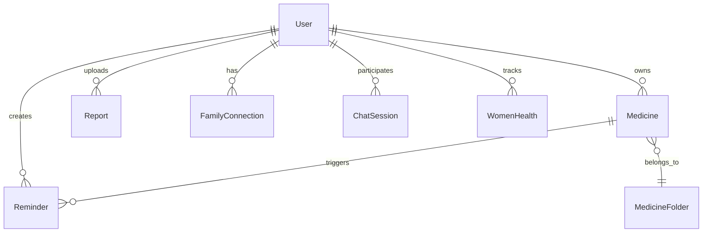

# MediTrack Health Platform - Design Document

## 1. System Architecture Overview

### 1.1 High-Level Architecture

MediTrack follows a modern full-stack architecture with AI-powered intelligence and real-time capabilities:

```
┌─────────────────┐    ┌─────────────────┐    ┌─────────────────┐
│   Frontend      │    │    Backend      │    │   External      │
│   (React)       │◄──►│   (Node.js)     │◄──►│   Services      │
│                 │    │                 │    │                 │
│ • React 19      │    │ • Express.js    │    │ • Google Gemini │
│ • Vite          │    │ • MongoDB       │    │ • Cloudinary    │
│ • Tailwind CSS  │    │ • Redis/BullMQ  │    │ • Supabase      │
│ • Framer Motion │    │ • JWT Auth      │    │ • Google OAuth  │
└─────────────────┘    └─────────────────┘    └─────────────────┘
```

### 1.2 Technology Stack

#### Frontend Stack
- **Framework**: React 19 with Vite for fast development
- **Styling**: Tailwind CSS with custom design system
- **Animations**: Framer Motion for smooth UI transitions
- **State Management**: React Context API with custom hooks
- **Routing**: React Router DOM v6
- **Icons**: Lucide React for consistent iconography
- **Charts**: Recharts for health analytics visualization
- **Maps**: React Leaflet for emergency services

#### Backend Stack
- **Runtime**: Node.js with Express.js framework
- **Database**: MongoDB with Mongoose ODM
- **Caching**: Redis with BullMQ for job processing
- **Authentication**: JWT tokens with Google OAuth 2.0
- **File Storage**: Cloudinary (images) + Supabase (PDFs)
- **AI Integration**: Google Gemini 2.5 Flash/Flash Lite
- **Email**: Nodemailer with SMTP configuration
- **Scheduling**: Node-cron for automated tasks

#### External Services
- **AI Model**: Google Generative AI (Gemini)
- **Cloud Storage**: Cloudinary for image optimization
- **Document Storage**: Supabase for PDF management
- **Authentication**: Google OAuth 2.0
- **Calendar**: Google Calendar API integration
- **OCR**: Tesseract.js for text extraction

---

## 2. System Design Patterns

### 2.1 Architectural Patterns

#### Model-View-Controller (MVC)
```
Controllers/     ← Handle HTTP requests and responses
├── authController.js
├── medicineController.js
├── reminderController.js
└── ...

Models/          ← Data models and business logic
├── User.js
├── Medicine.js
├── Reminder.js
└── ...

Routes/          ← API endpoint definitions
├── authRoutes.js
├── medicineRoutes.js
└── ...
```

#### Repository Pattern
- Mongoose models act as repositories
- Centralized data access logic
- Consistent error handling across data operations

#### Middleware Pattern
```javascript
// Authentication middleware pipeline
app.use(cors())
app.use(express.json())
app.use(authMiddleware)
app.use(activityTracker)
app.use(errorMiddleware)
```

### 2.2 Design Principles

#### Single Responsibility Principle
- Each controller handles one domain (auth, medicine, reminders)
- Separate services for complex business logic
- Dedicated middleware for cross-cutting concerns

#### Dependency Injection
- Configuration through environment variables
- Service injection for testability
- Database connection abstraction

#### Event-Driven Architecture
- Background job processing with BullMQ
- Asynchronous reminder scheduling
- Real-time notifications

---

## 3. Data Architecture

### 3.1 Database Design

#### Core Entities



#### User Schema
```javascript
{
  _id: ObjectId,
  name: String,
  email: String (unique),
  memberId: String (unique, MT-XXXXX),
  password: String (hashed),
  role: Enum['user', 'admin'],
  isVerified: Boolean,
  profilePictureUrl: String,
  phoneNumber: String,
  gender: Enum['male', 'female', 'other'],
  dateOfBirth: Date,
  bloodGroup: Enum['A+', 'A-', 'B+', 'B-', 'AB+', 'AB-', 'O+', 'O-'],
  healthScore: Number (0-100),
  healthState: Enum['GREEN', 'YELLOW', 'RED'],
  settings: {
    notifications: { ... },
    appearance: { ... },
    privacy: { ... }
  },
  google: {
    id: String,
    accessToken: String,
    refreshToken: String
  },
  emergencyContacts: [ContactSchema],
  familyMedicalHistory: [String],
  createdAt: Date,
  lastActive: Date
}
```

#### Medicine Schema
```javascript
{
  _id: ObjectId,
  userId: ObjectId (ref: User),
  name: String,
  form: String,
  category: String,
  genericName: String,
  dosage: String,
  quantity: Number,
  expiryDate: Date,
  manufactureDate: Date,
  manufacturer: String,
  batchNumber: String,
  imageUrl: String,
  folders: [ObjectId] (ref: MedicineFolder),
  organizationMetadata: {
    source: Enum['openfda', 'rxnorm', 'webscrape', 'manual'],
    confidence: Number (0-1),
    categorizedAt: Date
  },
  aiInsights: Object,
  createdAt: Date,
  updatedAt: Date
}
```

#### Reminder Schema
```javascript
{
  _id: ObjectId,
  targetUser: ObjectId (ref: User),
  createdBy: ObjectId (ref: User),
  medicine: ObjectId (ref: Medicine),
  medicineName: String,
  times: [String], // ["09:00", "21:00"]
  daysOfWeek: [String], // ["Mon", "Tue", ...]
  startDate: Date,
  endDate: Date,
  timezone: String,
  channels: {
    inApp: Boolean,
    email: Boolean,
    whatsapp: Boolean,
    sms: Boolean
  },
  watchers: [ObjectId] (ref: User),
  active: Boolean,
  lastTriggeredAt: Date,
  googleEventId: String
}
```

### 3.2 Data Flow Architecture

#### Request Flow
```
Client Request → CORS → Body Parser → Auth Middleware → 
Route Handler → Controller → Service → Model → Database
```

#### Response Flow
```
Database → Model → Service → Controller → 
Error Middleware → JSON Response → Client
```

#### Background Processing
```
Cron Trigger → Job Queue → Worker Process → 
Database Update → Notification Service → External API
```

---

## 4. API Design

### 4.1 RESTful API Structure

#### Authentication Endpoints
```
POST   /api/auth/register          - User registration
POST   /api/auth/login             - User login
POST   /api/auth/verify-email      - Email verification
POST   /api/auth/forgot-password   - Password reset request
POST   /api/auth/reset-password    - Password reset confirmation
GET    /api/auth/profile           - Get user profile
PUT    /api/auth/profile           - Update user profile
POST   /api/auth/google            - Google OAuth login
```

#### Medicine Management
```
GET    /api/medicines              - List user medicines
POST   /api/medicines              - Add new medicine
GET    /api/medicines/:id          - Get medicine details
PUT    /api/medicines/:id          - Update medicine
DELETE /api/medicines/:id          - Delete medicine
GET    /api/medicines/expiring     - Get expiring medicines
POST   /api/medicines/organize     - AI-powered organization
```

#### Reminder System
```
GET    /api/reminders              - List user reminders
POST   /api/reminders              - Create reminder
PUT    /api/reminders/:id          - Update reminder
DELETE /api/reminders/:id          - Delete reminder
POST   /api/reminders/:id/log      - Log medicine intake
GET    /api/pending-reminders      - Get pending reminders
```

#### Health Intelligence
```
GET    /api/dashboard/intelligence - Get health insights
POST   /api/ai/chat                - AI health chat
GET    /api/reports                - List health reports
POST   /api/reports/upload         - Upload medical report
GET    /api/reports/:id/analysis   - Get AI report analysis
```

### 4.2 API Response Format

#### Success Response
```javascript
{
  success: true,
  data: { ... },
  message: "Operation completed successfully",
  timestamp: "2024-01-24T10:30:00Z"
}
```

#### Error Response
```javascript
{
  success: false,
  error: {
    code: "VALIDATION_ERROR",
    message: "Invalid input data",
    details: { ... }
  },
  timestamp: "2024-01-24T10:30:00Z"
}
```

#### Pagination Response
```javascript
{
  success: true,
  data: [...],
  pagination: {
    page: 1,
    limit: 20,
    total: 150,
    pages: 8
  }
}
```

---

## 5. Security Architecture

### 5.1 Authentication & Authorization

#### JWT Token Strategy
```javascript
// Token structure
{
  header: {
    alg: "HS256",
    typ: "JWT"
  },
  payload: {
    userId: "user_id",
    email: "user@example.com",
    role: "user",
    iat: timestamp,
    exp: timestamp + 30_days
  }
}
```

#### Role-Based Access Control (RBAC)
```javascript
// Middleware implementation
const authorize = (roles) => {
  return (req, res, next) => {
    if (!roles.includes(req.user.role)) {
      return res.status(403).json({ 
        error: 'Insufficient permissions' 
      });
    }
    next();
  };
};
```

### 5.2 Data Protection

#### Encryption Strategy
- **Passwords**: bcrypt with salt rounds (10)
- **Sensitive Data**: AES-256 encryption for health data
- **Transmission**: HTTPS/TLS 1.3 for all communications
- **Storage**: Encrypted at rest in MongoDB

#### Privacy Controls
```javascript
// User privacy settings
{
  privacy: {
    showEmailOnProfile: false,
    showPhoneOnProfile: false,
    allowAnalytics: true,
    allowMarketingEmails: false
  },
  allowAIAccessToFoodChart: false
}
```

### 5.3 Input Validation

#### Request Validation
```javascript
// Using express-validator
const validateMedicine = [
  body('name').trim().isLength({ min: 1 }).escape(),
  body('quantity').isInt({ min: 0 }),
  body('expiryDate').optional().isISO8601(),
  // ... other validations
];
```

#### File Upload Security
```javascript
// Multer configuration
const upload = multer({
  storage: cloudinaryStorage,
  limits: { fileSize: 10 * 1024 * 1024 }, // 10MB
  fileFilter: (req, file, cb) => {
    const allowedTypes = /jpeg|jpg|png|pdf/;
    const extname = allowedTypes.test(
      path.extname(file.originalname).toLowerCase()
    );
    const mimetype = allowedTypes.test(file.mimetype);
    
    if (mimetype && extname) {
      return cb(null, true);
    } else {
      cb(new Error('Invalid file type'));
    }
  }
});
```

---

## 6. AI Integration Architecture

### 6.1 Google Gemini Integration

#### AI Service Layer
```javascript
class AIService {
  constructor() {
    this.genAI = new GoogleGenerativeAI(process.env.GEMINI_API_KEY);
    this.model = this.genAI.getGenerativeModel({ 
      model: "gemini-2.5-flash" 
    });
  }

  async analyzeHealthData(userData) {
    const prompt = this.buildHealthAnalysisPrompt(userData);
    const result = await this.model.generateContent(prompt);
    return this.parseHealthAnalysis(result.response.text());
  }

  async chatWithAI(message, context) {
    const prompt = this.buildChatPrompt(message, context);
    const result = await this.model.generateContent(prompt);
    return result.response.text();
  }
}
```

#### Health Intelligence Engine
```javascript
// Living OS - Background Intelligence
class HealthIntelligenceEngine {
  async performDailyHealthScan(userId) {
    const user = await User.findById(userId);
    const medicines = await Medicine.find({ userId });
    const reminders = await Reminder.find({ targetUser: userId });
    
    const analysis = await this.aiService.analyzeHealthData({
      user,
      medicines,
      reminders,
      adherenceData: await this.getAdherenceData(userId)
    });
    
    await this.updateHealthScore(userId, analysis);
    await this.generateAlerts(userId, analysis);
  }
}
```

### 6.2 AI-Powered Features

#### Medicine Organization
```javascript
async organizeMedicinesWithAI(userId) {
  const medicines = await Medicine.find({ userId });
  
  const organizationPrompt = `
    Analyze these medicines and suggest optimal organization:
    ${JSON.stringify(medicines)}
    
    Consider:
    - Medical conditions
    - Frequency of use
    - Drug interactions
    - Expiry dates
  `;
  
  const suggestions = await this.aiService.generateContent(organizationPrompt);
  return this.parseOrganizationSuggestions(suggestions);
}
```

#### Report Analysis
```javascript
async analyzeHealthReport(reportText, userId) {
  const userContext = await this.getUserHealthContext(userId);
  
  const analysisPrompt = `
    Analyze this medical report for user:
    Report: ${reportText}
    User Context: ${JSON.stringify(userContext)}
    
    Provide:
    1. Key findings
    2. Risk assessment
    3. Recommendations
    4. Questions for doctor
  `;
  
  return await this.aiService.generateContent(analysisPrompt);
}
```

---

## 7. Real-Time Features

### 7.1 Background Job Processing

#### BullMQ Queue System
```javascript
// Queue configuration
const reminderQueue = new Queue('reminder-processing', {
  connection: redisConnection,
  defaultJobOptions: {
    removeOnComplete: 100,
    removeOnFail: 50,
    attempts: 3,
    backoff: {
      type: 'exponential',
      delay: 2000,
    },
  },
});

// Worker implementation
const reminderWorker = new Worker('reminder-processing', async (job) => {
  const { reminderId, userId } = job.data;
  await processReminderNotification(reminderId, userId);
}, { connection: redisConnection });
```

#### Cron Job Scheduling
```javascript
// Daily health scan
cron.schedule('0 8 * * *', async () => {
  const activeUsers = await User.find({ 
    lastActive: { $gte: new Date(Date.now() - 7 * 24 * 60 * 60 * 1000) }
  });
  
  for (const user of activeUsers) {
    await healthIntelligenceEngine.performDailyHealthScan(user._id);
  }
});

// Reminder processing
cron.schedule('* * * * *', async () => {
  await processScheduledReminders();
});
```

### 7.2 Notification System

#### Multi-Channel Notifications
```javascript
class NotificationService {
  async sendReminder(reminder, user) {
    const notifications = [];
    
    if (reminder.channels.inApp) {
      notifications.push(this.sendInAppNotification(reminder, user));
    }
    
    if (reminder.channels.email) {
      notifications.push(this.sendEmailNotification(reminder, user));
    }
    
    if (reminder.channels.whatsapp) {
      notifications.push(this.sendWhatsAppNotification(reminder, user));
    }
    
    await Promise.allSettled(notifications);
  }
}
```

---

## 8. Frontend Architecture

### 8.1 Component Architecture

#### Component Hierarchy
```
App
├── AuthLayout
│   ├── Login
│   ├── Signup
│   └── ForgotPassword
├── DashboardLayout
│   ├── Sidebar
│   ├── Navbar
│   └── MainContent
│       ├── Dashboard
│       ├── Medicines
│       ├── Reminders
│       ├── Reports
│       └── Family
└── PublicLayout
    ├── LandingPage
    ├── About
    └── Contact
```

#### State Management
```javascript
// Auth Context
const AuthContext = createContext();

export const AuthProvider = ({ children }) => {
  const [user, setUser] = useState(null);
  const [loading, setLoading] = useState(true);
  
  const login = async (credentials) => {
    const response = await api.post('/auth/login', credentials);
    setUser(response.data.user);
    localStorage.setItem('token', response.data.token);
  };
  
  return (
    <AuthContext.Provider value={{ user, login, logout }}>
      {children}
    </AuthContext.Provider>
  );
};
```

### 8.2 UI Design System

#### Theme Configuration
```javascript
// Tailwind theme extension
module.exports = {
  theme: {
    extend: {
      colors: {
        primary: {
          50: '#f0f9ff',
          500: '#3b82f6',
          900: '#1e3a8a',
        },
        health: {
          green: '#10b981',
          yellow: '#f59e0b',
          red: '#ef4444',
        }
      },
      animation: {
        'fade-in': 'fadeIn 0.5s ease-in-out',
        'slide-up': 'slideUp 0.3s ease-out',
        'pulse-health': 'pulseHealth 2s infinite',
      }
    }
  }
}
```

#### Component Patterns
```javascript
// Reusable Card Component
const Card = ({ children, className, ...props }) => {
  return (
    <div 
      className={cn(
        "bg-white rounded-lg shadow-sm border border-gray-200 p-6",
        className
      )}
      {...props}
    >
      {children}
    </div>
  );
};

// Health State Indicator
const HealthPill = ({ healthState, score }) => {
  const colors = {
    GREEN: 'bg-green-500',
    YELLOW: 'bg-yellow-500',
    RED: 'bg-red-500'
  };
  
  return (
    <div className={cn(
      "px-3 py-1 rounded-full text-white text-sm font-medium",
      colors[healthState]
    )}>
      Health Score: {score}
    </div>
  );
};
```

---

## 9. Performance Optimization

### 9.1 Backend Optimization

#### Database Indexing
```javascript
// User collection indexes
userSchema.index({ email: 1 }, { unique: true });
userSchema.index({ memberId: 1 }, { unique: true, sparse: true });
userSchema.index({ lastActive: -1 });

// Medicine collection indexes
medicineSchema.index({ userId: 1, expiryDate: 1 });
medicineSchema.index({ userId: 1, name: 'text', genericName: 'text' });

// Reminder collection indexes
reminderSchema.index({ targetUser: 1, active: 1 });
reminderSchema.index({ startDate: 1, endDate: 1 });
```

#### Caching Strategy
```javascript
// Redis caching for frequently accessed data
const cacheService = {
  async getUserProfile(userId) {
    const cacheKey = `user:${userId}`;
    let user = await redis.get(cacheKey);
    
    if (!user) {
      user = await User.findById(userId);
      await redis.setex(cacheKey, 3600, JSON.stringify(user));
    }
    
    return JSON.parse(user);
  }
};
```

#### API Rate Limiting
```javascript
const rateLimit = require('express-rate-limit');

const apiLimiter = rateLimit({
  windowMs: 15 * 60 * 1000, // 15 minutes
  max: 100, // limit each IP to 100 requests per windowMs
  message: 'Too many requests from this IP'
});

app.use('/api/', apiLimiter);
```

### 9.2 Frontend Optimization

#### Code Splitting
```javascript
// Lazy loading for routes
const Dashboard = lazy(() => import('./pages/Dashboard'));
const Medicines = lazy(() => import('./pages/Medicines'));
const Reports = lazy(() => import('./pages/Reports'));

// Route configuration
<Routes>
  <Route path="/dashboard" element={
    <Suspense fallback={<Loader />}>
      <Dashboard />
    </Suspense>
  } />
</Routes>
```

#### Image Optimization
```javascript
// Cloudinary optimization
const optimizeImage = (url, options = {}) => {
  const { width = 400, height = 300, quality = 'auto' } = options;
  
  return url.replace('/upload/', 
    `/upload/w_${width},h_${height},q_${quality},f_auto/`
  );
};
```

---

## 10. Testing Strategy

### 10.1 Backend Testing

#### Unit Tests
```javascript
// Medicine controller tests
describe('Medicine Controller', () => {
  test('should create medicine with valid data', async () => {
    const medicineData = {
      name: 'Aspirin',
      dosage: '100mg',
      quantity: 30,
      expiryDate: '2025-12-31'
    };
    
    const response = await request(app)
      .post('/api/medicines')
      .set('Authorization', `Bearer ${token}`)
      .send(medicineData)
      .expect(201);
    
    expect(response.body.success).toBe(true);
    expect(response.body.data.name).toBe('Aspirin');
  });
});
```

#### Integration Tests
```javascript
// API integration tests
describe('Authentication Flow', () => {
  test('complete user registration and login flow', async () => {
    // Register user
    const registerResponse = await request(app)
      .post('/api/auth/register')
      .send({
        name: 'Test User',
        email: 'test@example.com',
        password: 'password123'
      });
    
    // Verify email
    await request(app)
      .post('/api/auth/verify-email')
      .send({
        email: 'test@example.com',
        otp: '123456'
      });
    
    // Login
    const loginResponse = await request(app)
      .post('/api/auth/login')
      .send({
        email: 'test@example.com',
        password: 'password123'
      });
    
    expect(loginResponse.body.token).toBeDefined();
  });
});
```

### 10.2 Frontend Testing

#### Component Tests
```javascript
// Medicine card component test
import { render, screen, fireEvent } from '@testing-library/react';
import MedicineCard from './MedicineCard';

test('displays medicine information correctly', () => {
  const medicine = {
    name: 'Aspirin',
    dosage: '100mg',
    quantity: 30,
    expiryDate: '2025-12-31'
  };
  
  render(<MedicineCard medicine={medicine} />);
  
  expect(screen.getByText('Aspirin')).toBeInTheDocument();
  expect(screen.getByText('100mg')).toBeInTheDocument();
  expect(screen.getByText('30 tablets')).toBeInTheDocument();
});
```

#### E2E Tests
```javascript
// Cypress end-to-end tests
describe('Medicine Management', () => {
  it('should allow user to add and view medicine', () => {
    cy.login('user@example.com', 'password');
    cy.visit('/medicines');
    
    cy.get('[data-testid="add-medicine-btn"]').click();
    cy.get('[data-testid="medicine-name"]').type('Aspirin');
    cy.get('[data-testid="medicine-dosage"]').type('100mg');
    cy.get('[data-testid="submit-btn"]').click();
    
    cy.contains('Aspirin').should('be.visible');
  });
});
```

---

## 11. Deployment Architecture

### 11.1 Production Environment

#### Infrastructure Setup
```yaml
# Docker Compose for production
version: '3.8'
services:
  frontend:
    build: ./frontend
    ports:
      - "80:80"
    environment:
      - NODE_ENV=production
  
  backend:
    build: ./backend
    ports:
      - "5000:5000"
    environment:
      - NODE_ENV=production
      - MONGODB_URI=${MONGODB_URI}
      - REDIS_URL=${REDIS_URL}
    depends_on:
      - mongodb
      - redis
  
  mongodb:
    image: mongo:7
    volumes:
      - mongodb_data:/data/db
  
  redis:
    image: redis:7-alpine
    volumes:
      - redis_data:/data

volumes:
  mongodb_data:
  redis_data:
```

#### Environment Configuration
```javascript
// Production environment variables
const config = {
  development: {
    PORT: 5000,
    MONGODB_URI: 'mongodb://localhost:27017/meditrack-dev',
    JWT_SECRET: 'dev-secret',
    REDIS_URL: 'redis://localhost:6379'
  },
  production: {
    PORT: process.env.PORT || 5000,
    MONGODB_URI: process.env.MONGODB_URI,
    JWT_SECRET: process.env.JWT_SECRET,
    REDIS_URL: process.env.REDIS_URL,
    GEMINI_API_KEY: process.env.GEMINI_API_KEY,
    CLOUDINARY_URL: process.env.CLOUDINARY_URL
  }
};
```

### 11.2 Monitoring & Logging

#### Application Monitoring
```javascript
// Health check endpoint
app.get('/health', async (req, res) => {
  try {
    // Check database connection
    await mongoose.connection.db.admin().ping();
    
    // Check Redis connection
    await redis.ping();
    
    // Check external services
    const geminiStatus = await checkGeminiAPI();
    
    res.json({
      status: 'healthy',
      timestamp: new Date().toISOString(),
      services: {
        database: 'connected',
        redis: 'connected',
        gemini: geminiStatus ? 'connected' : 'disconnected'
      }
    });
  } catch (error) {
    res.status(503).json({
      status: 'unhealthy',
      error: error.message
    });
  }
});
```

#### Error Tracking
```javascript
// Winston logger configuration
const winston = require('winston');

const logger = winston.createLogger({
  level: 'info',
  format: winston.format.combine(
    winston.format.timestamp(),
    winston.format.errors({ stack: true }),
    winston.format.json()
  ),
  transports: [
    new winston.transports.File({ filename: 'error.log', level: 'error' }),
    new winston.transports.File({ filename: 'combined.log' }),
    new winston.transports.Console({
      format: winston.format.simple()
    })
  ]
});
```

---

## 12. Correctness Properties

### 12.1 Data Integrity Properties

#### Property 1: User Authentication Consistency
**Validates: Requirements 2.1.2**
```javascript
// Property: Every authenticated request must have a valid JWT token
property('authenticated requests have valid tokens', () => {
  forAll(authenticatedRequest(), (request) => {
    const token = extractToken(request);
    return jwt.verify(token, JWT_SECRET) !== null;
  });
});
```

#### Property 2: Medicine Expiry Date Validation
**Validates: Requirements 2.2.1**
```javascript
// Property: Medicine expiry dates must be in the future when added
property('medicine expiry dates are future dates', () => {
  forAll(medicineData(), (medicine) => {
    if (medicine.expiryDate) {
      return new Date(medicine.expiryDate) > new Date();
    }
    return true; // Optional expiry dates are allowed
  });
});
```

#### Property 3: Reminder Time Consistency
**Validates: Requirements 2.3.1**
```javascript
// Property: Reminder times must be valid 24-hour format
property('reminder times are valid 24-hour format', () => {
  forAll(reminderTimes(), (times) => {
    return times.every(time => {
      const [hours, minutes] = time.split(':');
      return hours >= 0 && hours <= 23 && minutes >= 0 && minutes <= 59;
    });
  });
});
```

### 12.2 Business Logic Properties

#### Property 4: Health Score Calculation
**Validates: Requirements 2.4.1**
```javascript
// Property: Health scores must be between 0 and 100
property('health scores are within valid range', () => {
  forAll(healthData(), (data) => {
    const score = calculateHealthScore(data);
    return score >= 0 && score <= 100;
  });
});
```

#### Property 5: Family Connection Symmetry
**Validates: Requirements 2.6.1**
```javascript
// Property: Family connections must be bidirectional
property('family connections are symmetric', () => {
  forAll(familyConnection(), async (connection) => {
    const { userA, userB } = connection;
    const connectionAB = await FamilyConnection.findOne({
      requester: userA,
      recipient: userB,
      status: 'accepted'
    });
    const connectionBA = await FamilyConnection.findOne({
      requester: userB,
      recipient: userA,
      status: 'accepted'
    });
    
    return (connectionAB !== null) === (connectionBA !== null);
  });
});
```

### 12.3 Security Properties

#### Property 6: Password Hashing
**Validates: Requirements 2.1.1**
```javascript
// Property: Stored passwords must never be in plain text
property('passwords are always hashed', () => {
  forAll(userData(), (user) => {
    if (user.password) {
      return user.password !== user.originalPassword &&
             bcrypt.compareSync(user.originalPassword, user.password);
    }
    return true; // Google OAuth users may not have passwords
  });
});
```

#### Property 7: Data Access Authorization
**Validates: Requirements 2.10.2**
```javascript
// Property: Users can only access their own data
property('users access only their own data', () => {
  forAll(dataRequest(), (request) => {
    const { userId, requestedData } = request;
    return requestedData.every(item => 
      item.userId === userId || 
      item.sharedWith.includes(userId) ||
      item.isPublic
    );
  });
});
```

### 12.4 AI Integration Properties

#### Property 8: AI Response Consistency
**Validates: Requirements 2.9.1**
```javascript
// Property: AI responses must be contextually relevant
property('AI responses are contextually relevant', () => {
  forAll(healthQuery(), async (query) => {
    const response = await aiService.chatWithAI(query.message, query.context);
    return response.includes(query.expectedKeywords.some(keyword => 
      response.toLowerCase().includes(keyword.toLowerCase())
    ));
  });
});
```

### 12.5 Testing Framework Configuration

#### Property-Based Test Setup
```javascript
// Fast-check configuration for property-based testing
const fc = require('fast-check');

// Custom generators for domain objects
const medicineData = () => fc.record({
  name: fc.string({ minLength: 1, maxLength: 100 }),
  dosage: fc.string({ minLength: 1, maxLength: 50 }),
  quantity: fc.integer({ min: 0, max: 1000 }),
  expiryDate: fc.option(fc.date({ min: new Date() }))
});

const reminderTimes = () => fc.array(
  fc.string().filter(s => /^([01]?[0-9]|2[0-3]):[0-5][0-9]$/.test(s)),
  { minLength: 1, maxLength: 6 }
);

// Test execution
describe('MediTrack Property-Based Tests', () => {
  test('medicine expiry validation', () => {
    fc.assert(fc.property(
      medicineData(),
      (medicine) => validateMedicineExpiry(medicine)
    ));
  });
});
```

---

## 13. Future Enhancements

### 13.1 Scalability Improvements

#### Microservices Architecture
```
┌─────────────────┐  ┌─────────────────┐  ┌─────────────────┐
│   Auth Service  │  │Medicine Service │  │Reminder Service │
│                 │  │                 │  │                 │
│ • User mgmt     │  │ • Inventory     │  │ • Scheduling    │
│ • Authentication│  │ • Organization  │  │ • Notifications │
└─────────────────┘  └─────────────────┘  └─────────────────┘
         │                     │                     │
         └─────────────────────┼─────────────────────┘
                               │
                    ┌─────────────────┐
                    │  API Gateway    │
                    │                 │
                    │ • Rate limiting │
                    │ • Load balancing│
                    │ • Authentication│
                    └─────────────────┘
```

#### Event-Driven Architecture
```javascript
// Event bus implementation
class EventBus {
  constructor() {
    this.events = new Map();
  }
  
  emit(eventName, data) {
    const handlers = this.events.get(eventName) || [];
    handlers.forEach(handler => handler(data));
  }
  
  on(eventName, handler) {
    const handlers = this.events.get(eventName) || [];
    handlers.push(handler);
    this.events.set(eventName, handlers);
  }
}

// Usage
eventBus.on('medicine.added', async (data) => {
  await reminderService.suggestReminders(data.medicineId);
  await aiService.analyzeHealthImpact(data.userId);
});
```

### 13.2 Advanced AI Features

#### Machine Learning Pipeline
```python
# Health prediction model (Python/TensorFlow)
import tensorflow as tf
from sklearn.preprocessing import StandardScaler

class HealthPredictionModel:
    def __init__(self):
        self.model = self.build_model()
        self.scaler = StandardScaler()
    
    def build_model(self):
        model = tf.keras.Sequential([
            tf.keras.layers.Dense(128, activation='relu'),
            tf.keras.layers.Dropout(0.2),
            tf.keras.layers.Dense(64, activation='relu'),
            tf.keras.layers.Dense(1, activation='sigmoid')
        ])
        
        model.compile(
            optimizer='adam',
            loss='binary_crossentropy',
            metrics=['accuracy']
        )
        
        return model
    
    def predict_health_risk(self, user_data):
        scaled_data = self.scaler.transform([user_data])
        return self.model.predict(scaled_data)[0][0]
```

#### Computer Vision Integration
```javascript
// Pill identification service
class PillIdentificationService {
  constructor() {
    this.visionClient = new vision.ImageAnnotatorClient();
  }
  
  async identifyPill(imageBuffer) {
    const [result] = await this.visionClient.textDetection({
      image: { content: imageBuffer }
    });
    
    const detectedText = result.textAnnotations[0]?.description;
    
    // Use AI to match text with medicine database
    const medicineMatch = await this.aiService.matchMedicine(detectedText);
    
    return {
      detectedText,
      suggestedMedicine: medicineMatch,
      confidence: medicineMatch.confidence
    };
  }
}
```

### 13.3 Healthcare Integration

#### FHIR Compliance
```javascript
// FHIR resource mapping
class FHIRService {
  convertToFHIRPatient(user) {
    return {
      resourceType: 'Patient',
      id: user._id,
      identifier: [{
        system: 'https://meditrack.com/patient-id',
        value: user.memberId
      }],
      name: [{
        family: user.name.split(' ').pop(),
        given: user.name.split(' ').slice(0, -1)
      }],
      gender: user.gender,
      birthDate: user.dateOfBirth?.toISOString().split('T')[0],
      telecom: [{
        system: 'email',
        value: user.email
      }]
    };
  }
  
  convertToFHIRMedication(medicine) {
    return {
      resourceType: 'Medication',
      id: medicine._id,
      code: {
        coding: [{
          system: 'http://www.nlm.nih.gov/research/umls/rxnorm',
          code: medicine.rxnormCode,
          display: medicine.name
        }]
      },
      form: {
        coding: [{
          display: medicine.form
        }]
      }
    };
  }
}
```

---

This comprehensive design document provides the architectural foundation for the MediTrack Health Platform, covering all aspects from system architecture to future enhancements. The design emphasizes scalability, security, and user experience while maintaining the flexibility to evolve with changing requirements and technological advances.