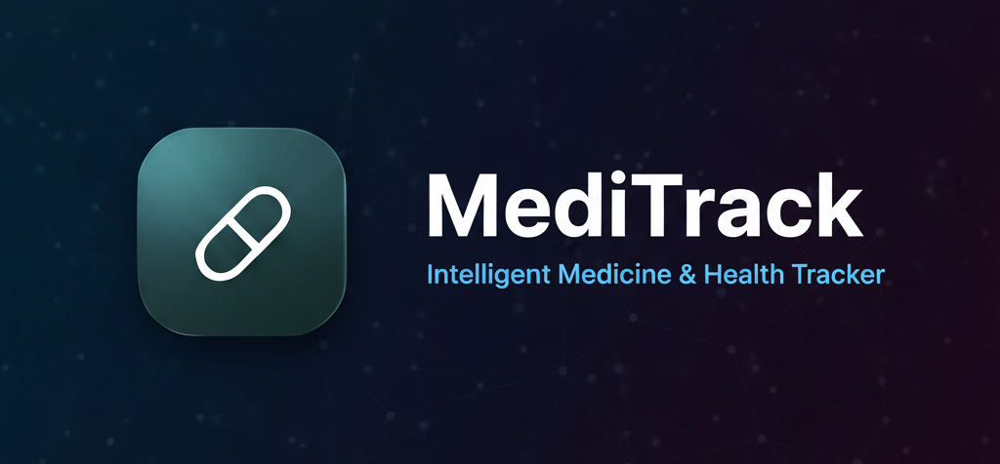

# MediTrack - Intelligent Medicine & Health Tracker

**MediTrack** is a comprehensive, AI-powered health management application designed to simplify how you track medicines, monitor health habits, and manage family well-being with extended public health support. By leveraging advanced AI (Google Gemini), MediTrack goes beyond simple scheduling to provide deep insights into your health data, organize your medication inventory, and analyze medical reports.

## ⚠️ License Notice

This repository is protected under a proprietary license.
Unauthorized copying, reuse, or redistribution of the code is strictly prohibited.

---

## 🌟 Key Features

### 🧠 Next-Gen Health Intelligence (New!)
*   **Predictive Future Analysis**: The AI engine analyzes your trends to predict potential health risks *before* they happen (e.g., "Risk of Glucose Spike due to low adherence").
*   **Domain-Aware Insights**: Automatically categorizes your health status by medical domain (Cardiology, Endocrinology, General Health) based on your uploaded reports.
*   **Real-Time Trajectory**: Dynamic "Health Score" transparency that shows if your condition is Improving, Stable, or Declining.
*   **AI Health Chat Assistant**: A 24/7 intelligent assistant to answer your health queries and provide guidance.

### 🎨 Premium "Ambient Aura" UI (New!)
*   **Ambient Widget**: The Dashboard widget features a living, breathing background that changes color based on your health risk (Red for High Alert, Amber for Moderate, Teal for Good).
*   **Dynamic Navbar**: An auto-collapsing "Health Pill" in the navigation bar keeps you constantly aware of your status without cluttering the screen.
*   **Smart Interactions**: Smooth animations and glassmorphism elements provide a high-end, native app feel.

### 📄 Intelligent Report Management
*   **Smart OCR & Analysis**: Upload PDF or images of reports. Our AI extracts key data points (Vitals, Lab Results) automatically.
*   **Context-Aware Filtering**: Filter your history by specific conditions (e.g., "Show me only Diabetes-related reports") to see a focused timeline.
*   **Health Thesis**: Generates a comprehensive summary "thesis" of your clinical status from multiple documents.

### 💊 Advanced Medicine Management
*   **Inventory Tracking**: Keep a digital inventory of all your medicines, including expiry dates and stock levels.
*   **Smart Reminders**: Customizable reminders for taking medicines, refilling stock, and attending appointments.
*   **Expiry Alerts**: Get notified before your medicines expire so you can replace them in time.
*   **Detailed Medicine Info**: Access detailed information about your medications, including side effects and usage instructions.

### 👨‍👩‍👧‍👦 Family Care & Lifestyle
*   **Family Profiles**: Create and manage profiles for all family members in one place.
*   **Caregiver Support**: Track medication adherence for children or elderly parents.
*   **Food & Habit Tracking**: Log meals and vitals to see how lifestyle choices impact your health.

---

## 🛠️ Tech Stack

### Frontend
*   **Framework**: React.js (Vite)
*   **Styling**: Tailwind CSS, Framer Motion (for animations)
*   **Icons**: Lucide React
*   **State Management**: React Context API
*   **Routing**: React Router DOM

### Backend
*   **Runtime**: Node.js
*   **Framework**: Express.js
*   **Database**: MongoDB (Mongoose),Cloudinary, Supabase
*   **Authentication**: JWT, Google OAuth 2.0
*   **Security**: AES-256 for better encryption

### AI & Services
*   **AI Model**: Google Gemini 2.5 Flash / 2.5 Flash Lite
*   **OCR**: Tesseract.js / Google Vision (for report scanning)
*   **Storage**: Cloudinary (for image/report storage)
*   **Email**: Nodemailer (for notifications)
*   **Scheduling**: Node-cron

---

## 🚀 Getting Started

Follow these steps to set up the project locally.

### Prerequisites
*   Node.js (v16 or higher)
*   MongoDB (Local or Atlas URI)
*   Git

---
*Created with ❤️ by the MediTrack Team*

